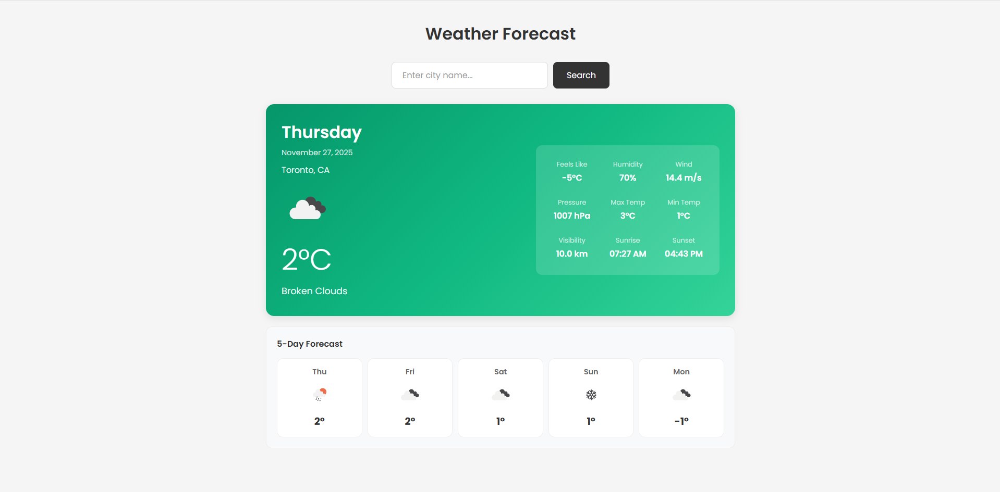

# Weather Forecast App (For lab test 2)

## Description
A React-based weather application that displays current weather and 5-day forecast for any city using the OpenWeatherMap API.

## Features

- Search weather by city name
- Current weather display (temperature, humidity, wind, pressure)
- Weather condition with icons
- 5-day weather forecast

## API Used

**OpenWeatherMap API**
- Current Weather: `https://api.openweathermap.org/data/2.5/weather`
- 5-Day Forecast: `https://api.openweathermap.org/data/2.5/forecast`

## Notes

- Temperature is displayed in Celsius
- Default city is Toronto

